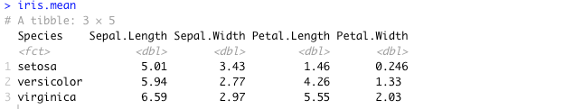

# Postwork Sesión 2

### Objetivo

- Conocer algunas de las bases de datos disponibles en `R`
- Observar algunas características y manipular los DataFrames con `dplyr`
- Realizar visualizaciones con `ggplot`

### Requisitos

1. Tener instalado R y RStudio
2. Haber realizado el prework y estudiado los ejemplos de la sesión.

### Desarrollo

1. Inspecciona el DataSet iris disponible directamente en R. Identifica las variables que contiene y su tipo, asegúrate de que no hayan datos faltantes y que los datos se encuentran listos para usarse.
    
    ```r
    str(iris)
    View(iris)
    
    sum(complete.cases(iris))
    ```
    
    
    
    El dataset contiene 150 observaciones y la suma de casos completos es 150, por lo tanto no hay datos faltantes.
    
2. Crea una gráfica de puntos que contenga `Sepal.Lenght` en el eje horizontal, `Sepal.Width` en el eje vertical, que identifique `Species`por color y que el tamaño de la figura está representado por `Petal.Width`. Asegúrate de que la geometría contenga `shape = 10` y `alpha = 0.5`.
    
    ```r
    g_iris <- ggplot(iris, aes(x= Sepal.Length, 
                     y = Sepal.Width,
                     color= Species, 
                     size = Petal.Width,
                     )) + 
      geom_point(shape = 10, alpha = 0.5)
    
    g_iris 
    ```
    
    
    
3. Crea una tabla llamada `iris_mean` que contenga el promedio de todas las variables agrupadas por `Species`.
    
    ```r
    iris.mean <- iris %>% group_by(Species) %>%
      summarise( Sepal.Length=mean(Sepal.Length),
                 Sepal.Width=mean(Sepal.Width),
                 Petal.Length=mean(Petal.Length),
                 Petal.Width=mean(Petal.Width))
    
    iris.mean
    ```
    
    
    
4. Con esta tabla, agrega a tu gráfica anterior otra geometría de puntos para agregar los promedios en la visualización. Asegúrate que el primer argumento de la geometría sea el nombre de tu tabla y que los parámetros sean `shape = 23`, `size = 4`, `fill = "black"` y `stroke = 2`. También agrega etiquetas, temas y los cambios necesarios para mejorar tu visualización.
    
    ```r
    g_iris <- g_iris +
      geom_point(data = iris.mean,
                 shape = 23, 
                 size = 4,
                 fill = 'black',
                 stroke = 2
      )
      
    g_iris <- g_iris + labs(title = "Iris dataset",
                            x = "Largo del Sépalo",
                            y = "Ancho del Sépalo") + 
      theme_classic()
    
    g_iris
    ```
    
    
    
    ## Conclusión
    
    En este postwork reforzamos los conocimientos:
    
    - Uso de `complete.cases()` para verificar si en el dataset hay datos incompletos.
    - Graficas scatter con `geom_point()` para visualizar los datos con **ggplot**.
    - El uso de las funciones para manipulación y transformación de dataframes de la librería **dplyr**:  `group_by()`, `summarise()`, `%>%`.