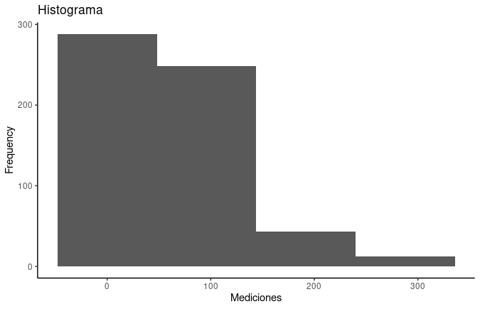
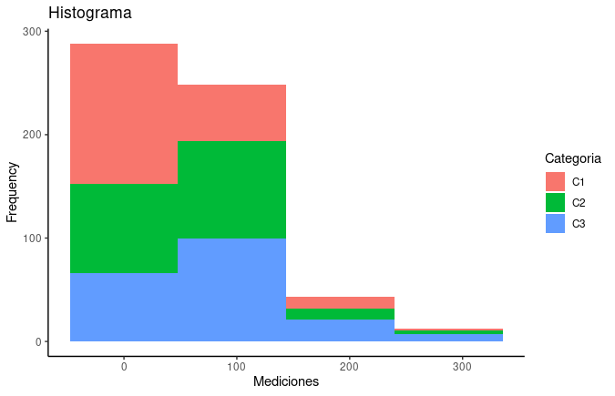
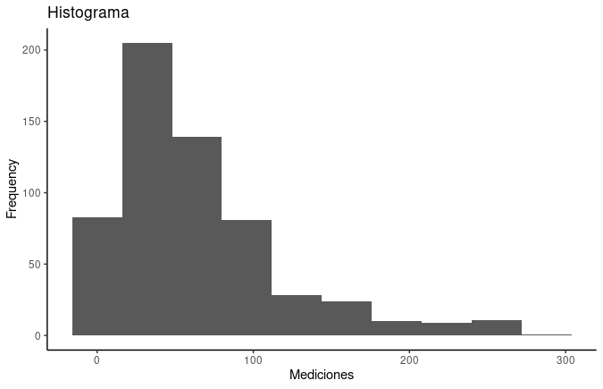
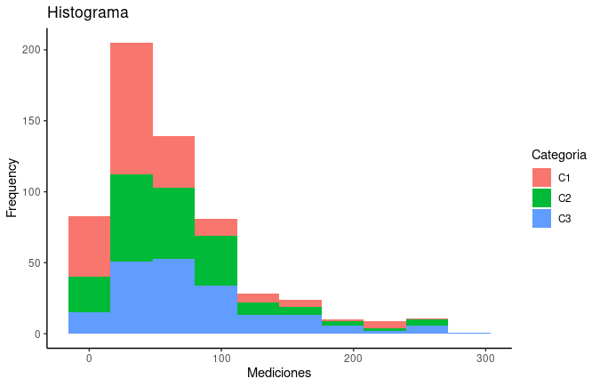
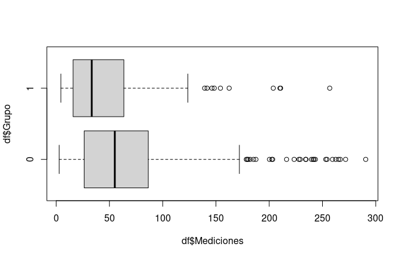

# Postwork Sesión 3

##### Desarrollo

"Utilizando el dataframe `boxp.csv` realiza el siguiente análisis descriptivo. No olvides excluir los missing values y transformar las variables a su
tipo y escala correspondiente."

```
df <- read.csv("./data/boxp.csv")
```

##### 1) Calcula e interpreta las medidas de tendencia central de la variable `Mediciones`

```
# Medidas de tendencia central
> mean(df.clean$Mediciones)
[1] 62.88494
> median(df.clean$Mediciones)
[1] 49.3
> Mode(df.clean$Mediciones)
[1] 23.3
attr(,"freq")
[1] 6
```

##### 2) Con base en tu resultado anterior, ¿qué se puede concluir respecto al sesgo de `Mediciones`?

-Siendo que las mediciones se encuentran entre 2.8 y 290.6
-Una Media de 62.885 indica un sesgo cargado hacia la izquierda.
-Una moda de 23.3 con freq 6 veces.
Media>Mediana>Moda

##### 3) Calcula e interpreta la desviación estándar y los cuartiles de la distribución de `Mediciones`

```
> # Medidas de dispersión
> var(df$Mediciones)
[1] 2891.183
> sd(df$Mediciones)
[1] 53.76972
> IQR(df$Mediciones)
[1] 59.4
> cuartiles <- quantile(df$Mediciones, probs = c(0.25,0.5,0.75))
> cuartiles
  25%   50%   75% 
23.45 49.30 82.85 
```

##### 4) Con ggplot, realiza un histograma separando la distribución de `Mediciones` por `Categoría`


Histograma a 4 barras


¿Consideras que sólo una categoría está generando el sesgo?"

- No considero que sea una categoria la generadora del sesgo se observa que las tres categorias tienen el mismo sesgo individual.


Histograma a 10 barras


##### 5) Con ggplot, realiza un boxplot separando la distribución de `Mediciones` por `Categoría` y por `Grupo` dentro de cada categoría

 ¿Consideras que hay diferencias entre categorías?

- LAs diferencias son en el numero de elemntos que las componenen
 ¿Los grupos al interior de cada categoría
podrían estar generando el sesgo?"
- Si por el numero de mediciones que las componen llevan el sesgo a la izquierda.


