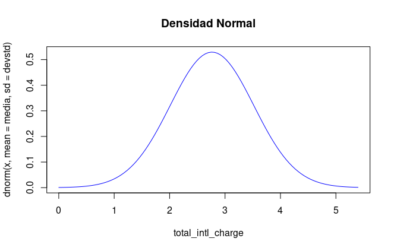

# Postwork Sesión 4

#### Objetivo

- Realizar un análisis probabilístico del total de cargos internacionales de una compañía de telecomunicaciones

#### Desarrollo

Utilizando la variable `total_intl_charge` de la base de datos `telecom_service.csv` de la sesión 3, realiza un análisis probabilístico. Para ello, debes determinar la función de distribución de probabilidad que más se acerque el comportamiento de los datos.
Hint: Puedes apoyarte de medidas descriptivas o técnicas de visualización.

```
> # Medidas de tendencia central
> summary(df$total_intl_charge)
   Min. 1st Qu.  Median    Mean 3rd Qu.    Max. 
  0.000   2.300   2.780   2.765   3.270   5.400 
> mean(df$total_intl_charge)
[1] 2.764581
> median(df$total_intl_charge)
[1] 2.78
> Mode(df$total_intl_charge)
[1] 2.7
attr(,"freq")
[1] 62

> # Medidas de dispersión
> sd(df$total_intl_charge)
[1] 0.7537726
> var(df$total_intl_charge)
[1] 0.5681732
> IQR(df$total_intl_charge)
[1] 0.97
> cuartiles <- quantile(df$total_intl_charge, probs = c(0.25,0.5,0.75))
> cuartiles
 25%  50%  75% 
2.30 2.78 3.27 
```

- Se puede observar que la Media, Median y Moda tiene un valor aprox de 2.7x, con valores  entre 0 y 5.4

Una vez que hayas seleccionado el modelo, realiza lo siguiente:

- Consideresé una distribución simétrica o normal.

1) Grafica la distribución teórica de la variable aleatoria `total_intl_charge`

2) ¿Cuál es la probabilidad de que el total de cargos internacionales sea menor a 1.85 usd?

```
> pnorm(1.85, mean=media, sd=devstd, lower.tail = T)
[1] 0.1125002

```

3) ¿Cuál es la probabilidad de que el total de cargos internacionales sea mayor a 3 usd?

```
> pnorm(3, mean=media, sd=devstd, lower.tail=FALSE)
[1] 0.3773985

```

4) ¿Cuál es la probabilidad de que el total de cargos internacionales esté entre 2.35usd y 4.85 usd?

```
> pnorm(4.85, mean=media, sd=devstd) - pnorm(2.35, mean=media, sd=devstd)
[1] 0.7060114

```

5) Con una probabilidad de 0.48, ¿cuál es el total de cargos internacionales más alto que podría esperar?

```
> qnorm(p=0.48, mean=media, sd=devstd)
[1] 2.726777

```

6) ¿Cuáles son los valores del total de cargos internacionales que dejan exactamente al centro el 80% de probabilidad?

```
an=media, sd=devstd)
[1] 3.398972
```
