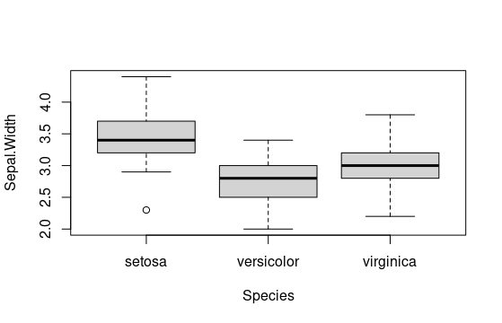

# Postwork Sesión 5

#### OBJETIVO

- Realizar inferencia estadística para extraer información de la muestra que sea contrastable con la población

##### DESARROLLO

El data frame iris contiene información recolectada por Anderson sobre 50 flores de 3 especies distintas (setosa, versicolor y virginca), incluyendo medidas en centímetros del largo y ancho del sépalo así como de los pétalos.

Estudios recientes sobre las mismas especies muestran que:

- 1) En promedio, el largo del sépalo de la especie setosa (Sepal.Length) es igual a 5.7 cm
- 2) En promedio, el ancho del pétalo de la especie virginica (Petal.Width) es menor a 2.1 cm
- 3) En promedio, el largo del pétalo de la especie virgínica es 1.1 cm más grande que el promedio del largo del pétalo de la especie versicolor.
- 4) En promedio, no existe diferencia en el ancho del sépalo entre las 3 especies.

Utilizando pruebas de inferencia estadística, concluye si existe evidencia suficiente para concluir que los datos recolectados por Anderson están en línea con los nuevos estudios.

Utiliza 99% de confianza para toda las pruebas, en cada caso realiza el planteamiento de hipótesis adecuado y concluye."

"1) En promedio, el largo del sépalo de la especie setosa (Sepal.Length) es igual a 5.7 cm"
"Planteamiento de hipótesis:
Ho: prom_Sepal.Lengths(setosa) == 5.7
Ha: prom_Sepal.Length(setosa) =! 5.7"

```
 t.test(iris[iris$Species == 'setosa',
+             "Sepal.Length"],
+        alternative = 'two.sided', mu=5.7)

 One Sample t-test

data:  iris[iris$Species == "setosa", "Sepal.Length"]
t = -13.922, df = 49, p-value < 2.2e-16
alternative hypothesis: true mean is not equal to 5.7
95 percent confidence interval:
 4.905824 5.106176
sample estimates:
mean of x 
    5.006 
```

"2) En promedio, el ancho del pétalo de la especie virginica (Petal.Width) es
menor a 2.1 cm"
"Planteamiento de hipótesis:
Ho: prom_Petal.Width(virginica) >= 5.7
Ha: prom_Petal.Width(virginica) < 5.7"

```
> t.test(iris[iris$Species == 'virginica', 
+             "Petal.Width"],
+        alternative = 'less', mu=2.1)

 One Sample t-test

data:  iris[iris$Species == "virginica", "Petal.Width"]
t = -1.9052, df = 49, p-value = 0.03132
alternative hypothesis: true mean is less than 2.1
95 percent confidence interval:
    -Inf 2.09112
sample estimates:
mean of x 
    2.026 
```

"3) En promedio, el largo del pétalo de la especie virgínica es 1.1 cm más
grande que el promedio del largo del pétalo de la especie versicolor."
"Planteamiento de hipótesis:
Ho: prom_Petal.Length >= 1.1
Ha: prom_Petal.Length < 1.1"

```
var.test(iris[iris$Species == "virginica", "Petal.Length"],
         iris[iris$Species == "versicolor", "Petal.Length"],
         ratio = 1, alternative = "two.sided")

 F test to compare two variances

data:  iris[iris$Species == "virginica", "Petal.Length"] and iris[iris$Species == "versicolor", "Petal.Length"]
F = 1.3794, num df = 49, denom df = 49, p-value = 0.2637
alternative hypothesis: true ratio of variances is not equal to 1
95 percent confidence interval:
 0.7827605 2.4307127
sample estimates:
ratio of variances 
          1.379372 

> t.test(x=iris[iris$Species == "virginica", "Petal.Length"],
+        y=iris[iris$Species == "versicolor", "Petal.Length"],
+        alternative = "greater", mu = 1.1, var.equal = TRUE)

 Two Sample t-test

data:  iris[iris$Species == "virginica", "Petal.Length"] and iris[iris$Species == "versicolor", "Petal.Length"]
t = 1.873, df = 98, p-value = 0.03202
alternative hypothesis: true difference in means is greater than 1.1
95 percent confidence interval:
 1.121779      Inf
sample estimates:
mean of x mean of y 
    5.552     4.260 

```

"4) En promedio, no existe diferencia en el ancho del sépalo entre las 3
especies"

```
library(dplyr);
summary(iris)
str(iris)
>iris_mean.1<-iris %>% group_by(Species) %>% summarise(Sepal.Length = mean(Sepal.Length),
                                                      Sepal.Width = mean(Sepal.Width),
                                                      Petal.Length = mean(Petal.Length),
                                                      Petal.Width = mean(Petal.Width), n = n())  
>iris_mean.1
# A tibble: 3 × 6
  Species    Sepal.Length Sepal.Width Petal.Length Petal.Width     n
  <fct>             <dbl>       <dbl>        <dbl>       <dbl> <int>
1 setosa             5.01        3.43         1.46       0.246    50
2 versicolor         5.94        2.77         4.26       1.33     50
3 virginica          6.59        2.97         5.55       2.03     50
```

"El análisis de varianza (de un factor) nos permite comparar la media de una
variable considerando dos o más niveles/grupos de factor. Entre muchas otras
aplicaciones del ANOVA, esta técnica puede emplearse como una extensión de la
prueba t de Student."
"Planteamiento de hipótesis:
Ho: prom_Sepal.Width(virginica) ==  prom_Sepal.Width(versicolor) == prom_Sepal.Width(setosa )
Ha: prom_Sepal.Width =! Al menos uno es diff"

```
>boxplot(Sepal.Width ~ Species, data = iris)
```



```
>anova <- aov(Sepal.Width ~ Species, data = iris)
> summary(anova)
             Df Sum Sq Mean Sq F value Pr(>F)    
Species       2  11.35   5.672   49.16 <2e-16 ***
Residuals   147  16.96   0.115                   
---
Signif. codes:  0 ‘***’ 0.001 ‘**’ 0.01 ‘*’ 0.05 ‘.’ 0.1 ‘ ’ 1
```
