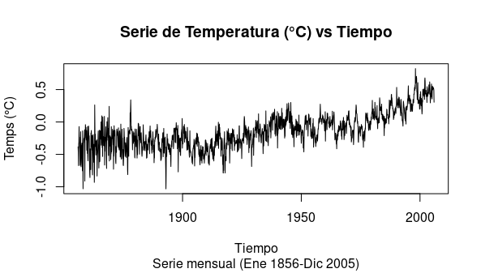
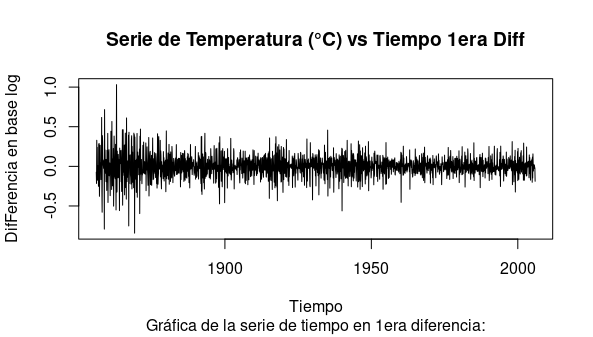
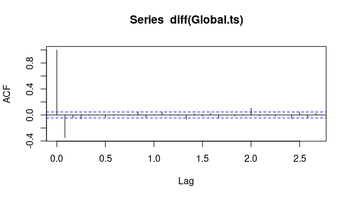
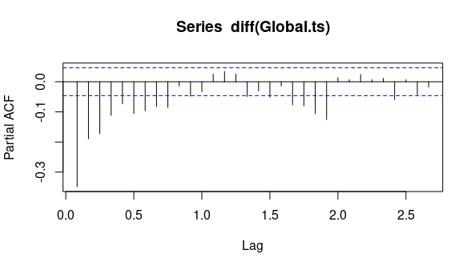

###### Postwork S8. Predicciones de la temperatura global

##### Desarrollo

Utilizando el siguiente vector numérico, realiza lo que se indica:

```R
url = "https://raw.githubusercontent.com/beduExpert/Programacion-R-Santander-2022/main/Sesion-07/Data/global.txt"
Global <- scan(url, sep="")
```

1) Crea una objeto de serie de tiempo con los datos de Global. La serie debe ser mensual
comenzado en Enero de 1856

2) Realiza una gráfica de la serie de tiempo anterior de 2005")



3) Ahora realiza una gráfica de la serie de tiempo anterior, transformando a la
primera diferencia:

4) ¿Consideras que la serie es estacionaria en niveles o en primera diferencia?

##### En 1era diferencia

5) Con base en tu respuesta anterior, obten las funciones de autocorrelación y autocorrelación parcial?

```
?acf; #función de autocorrelación
acf(diff(Global.ts))
```



```
?pacf; #función de autocorrelación parcial
pacf(diff(Global.ts))
 ```

 
