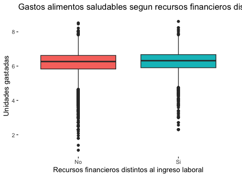
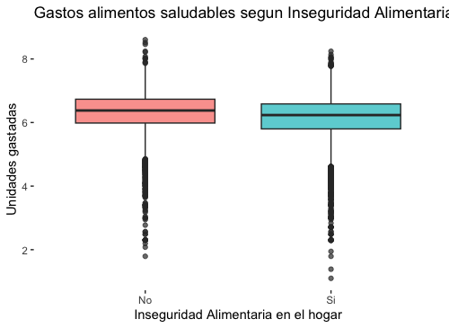

# Postwork sesión 8

## Análisis de la Inseguridad Alimentaria en México

### DESARROLLO

#### 1. Plantea el problema del caso

De acuerdo a (Shamah-Levy, 2014) la inseguridad alimentaria se define como la disponibilidad limitada o incierta de alimentos nutricionalmente adecuados e inocuos; o la capacidad limitada e incierta de adquirir alimentos adecuados en formas socialmente aceptables. En México, casi una cuarta parte de la población enfrenta algún nivel de inseguridad alimentaria (1).

Por ello, un centro de salud nutricional está interesado en analizar estadísticamente y probabilísticamente el fenómeno de la inseguridad alimentaria para poder desarrollar un modelo que permita identificar los determinantes socioeconómicos detrás de ella.

Adicionalmente, se plantea el supuesto de que los hogares con menor nivel socioeconómico tienden a gastar más en productos no saludables que las personas con mayores niveles socioeconómicos y se quiere validar la veracidad de tal dicho.

En el presente trabajo, se analizará la información disponible a fin de concluir, con argumentos estadísticos y probabilísticos, si el supuesto planteado tiene mérito o no y se sugerirá un modelo que explique lo mejor posible el fenómeno de la inseguridad alimentaria en el hogar.

#### 2. Realiza un análisis descriptivo de la información

La base de datos proporcionada contiene un total de 40,809 observaciones con 10 variables. En la Tabla 1 se describen las variables.

Tabla 1. Descripción de los datos proporcionados.

<!--  -->

Después de revisar los datos  originales en R, se realizó la limpieza de los datos y el cambio de algunos tipos de datos para facilitar la manipulación del análisis. En particular, se realizó el cambio de las variables: logaritmo natural de gastos en alimentos saludables y logaritmo natural de gastos en alimentos no saludables aplicando el antilogaritmo para una mejor interpretación de las cifras. Por último, se eliminaron 20,529 registros que presentaron datos incompletos en alguna variable.  
Dado que en los requisitos del problema se solicita analizar los patrones de los gastos en alimentos saludables (aln) y gastos en alimentos no saludables (alns)  en los hogares mexicanos en relación a la variables: nivel socioeconómico (nse), si el hogar tienen recursos financieros extras al ingreso (refin) y si presenta o no inseguridad alimentaria (IA). Se presentan las siguientes gráficas para realizar un análisis exploratorio de los datos previo al cálculo de las medidas descriptivas de las variables mencionadas anteriormente.

En la siguiente sección nos enfocamos en primer lugar, en las variables: als, alns.

Gráfica 1. Los gasto en alimentos saludables (als)  muestran un mínimo: 3.0, primer cuartil: 345.0, media: 593.98 , mediana: 530.5, tercer cuartil: 760.0 y máximo: 5640

Gráfica 2. Los gastos en alimentos saludables (alns) muestran un mínimo: 1.0, primer cuartil: 30.0, media: 107.89 , mediana: 55.0, tercer cuartil: 130.0 y máximo: 4,015

En las Gráficas 1 y 2, se muestran las medidas de tendencia central y de posición. Además, se calculó la desviación estándar para als:  359.01  y alns: 145.76, con la finalidad de calcular el coeficiente de variación. El coeficiente de variación de als es 60.44% y de alns es de 135.09%. Ambos coeficientes de variación son mayores al 25% por lo que se puede concluir que los datos para ambas variables no son homogéneos. Este supuesto se puede inferir gráficamente debido a la cantidad de datos atípicos que se muestran en el Gráfico 1 y Gráfico 2. A pesar de que las cajas son cortas, los datos atípicos nos alertan de un posible sesgo de los datos, en particular sobre la parte superior de las cajas.

Para complementar el análisis de estas dos variables se analizan  visualmente las gráficas de caja de aln de acuerdo al nivel socioeconómico (nse), ver Gráfica 3,  de acuerdo al recursos financieros distintos al ingreso laboral (ver Gráfica 4) y de la misma forma para inseguridad alimentaria .

als vs nes5f

Gráfica 3. En esta gráfica se muestran las medidas descriptivas de aln en cada nivel socioeconómico (bajo, medio bajo, medio, medio alto y alto).

Los promedio en la Gráfica 3 muestran que el promedio de consumo de als se incrementa de acuerdo al nivel socioeconómico, sin embargo, no se puede dar una conclusión a partir de esta análisis exploratorio de los datos, debido a que se sabe que la variable no es homogénea.

als vs  refin

Gráfico 4. Muestra las medidas de tendencia central de als, si la familia indicó recursos financieros distintos al ingreso laboral. Si bien las medias muestran niveles de consumo promedio similares tanto para los que individuos que reportaron ingresos financieros extra distintos al laboral y los que no los tienen, no podemos concluir que sean iguales puesto que la variable no es homogénea

als vs IA

Gráfica 5. Muestra las medidas de tendencia central de als, de acuerdo a si presentaron o no inseguridad alimentaria en el hogar (IA). Las medias muestran niveles de consumo promedio similares, con una ligero gasto mayor de als por las familias que no presentaron IA. Sin embargo, no podemos concluir que esto sea correcto puesto que la variable no es homogénea.

alns vs  refin

Gráfica 6. Muestra las medidas de tendencia central de alns, con respecto a las familia que indicaron recursos financieros distintos al ingreso laboral. En el gráfico se puede observar que las medias muestran niveles de consumo promedio similares, sin embargo, el promedio de gastos de aquellos que no presentan recursos financieros al ingreso laborales es ligeramente mayor a los que sí lo presentan. Este análisis exploratorio de los datos no puede ser considerado correcto dado que la variable alns no es homogénea.

alns vs nes5f

Gráfica 7. El gráfico muestra  las medidas de tendencia central de als según el nivel socioeconómico de los hogares consultados.  Se observa que los promedios de consumo de als se incrementan conforme aumenta el nivel socioeconómico, sin embargo, no es posible realizar una conclusión a partir del análisis exploratorio de los datos, puesto que se sabe que la variable no es homogénea.

alns vs IA

Gráfica 8. Se observa que las medidas de tendencia central de alns, con respecto a las familias que presentan Inseguridad se acercan. Si bien las medias presentan valores similares cercanos a cero, el análisis de los datos no puede ser considerado correcto dado que la variable alns no es homogénea.

Para continuar el análisis de als y alns se realizaron histogramas que permitan conocer la frecuencia de los gastos que reportaron las familias.

-- Aquí se ocupan las gráficas de frecuencia de als y alns---

Además de las medidas de tendencia central y dispersión se consideró importante calcular las medidas de forma. En el caso de als se tiene un skewness de 1.69 y una kurtosis de , lo que confirma la existencia de un sesgo de los datos a la izquierda; y además, un forma leptocúrtica.  Para alns se obtuvo un skewnwss de 4.91 y una kurtosis de 57.41, es decir, presenta un sesgo a la derecha y una forma leptocúrtica.

Otra variable que es importante analizar para conocer la frecuencia relativa es la Inseguridad alimentaria en el hogar (IA). En la Gráfica X. se muestra la frecuencia de si se presenta o no inseguridad alimentaria en los datos proporcionados de la base de datos

--Aquí se ocupa gráfica de frecuencia de IA---
En la Gráfica X, se muestra que el 74% de las familias que participaron en la muestra presentan inseguridad alimentaria en el hogar. Por lo tanto, el 26% restante no presentó riesgo.

En esta segunda sección, primero se realizó un análisis visual de los datos, para después realizar un análisis descriptivo de los datos. Los resultados obtenidos en los coeficientes de variación indican que el promedio no es confiable para dar respuesta a las cuestiones planteadas en la sección uno, incluso la mediana y las medidas de posición no son concluyentes debido a la cantidad de datos atípicos que muestra la base de datos utilizada. Por lo tanto realizaremos en la siguiente sección un análisis probabilístico que nos permite explicar el problema.

#### 3. Cálculo de probabilidades para entender el problema en México

Calcula probabilidades que nos permitan entender el problema en México

![gráfica de densidad de alns)(./assets/densidad_alns.png)
alns

Gráfica 9
![gráfica de densidad de probabilidad alns)(./assets/densidad_prob_alns.png)

Gráfica 10
DESC

"Calcula P(X <= 312): (salario mínimo 2023 frontera, 207 resto país) "
Probabilidad =  0.9192906

![gráfica de densidad de probabilidad plot alns)(./assets/densidad_prob_plot_alns_p1.png)

Gráfica 11
"Calcula P(X <= 312): (salario mínimo 2023)"
probabilidad: 0.9192906
"Calcula P(0 <= X <= 312):"
probabilidad: 0.689698
![gráfica de densidad de probabilidad plot alns)(./assets/densidad_prob_plot_alns_p2.png)

Gráfica 12
"Calcula P(X >= 312):"
probabilidad:  0.08070942

![gráfica de densidad de probabilidad plot alns)(./assets/densidad_prob_plot_alns_p3.png)

Gráfica 13

#### 5. Estima un modelo de regresión, lineal o logístico, para identificar los determinantes de la inseguridad alimentaria en México

Como se busca entender qué factores influyen en la inseguridad alimentaria se define IA como la variable objetivo o dependiente. Debido a que ésta es de tipo dicotómico, lo apropiado para modelarla es una regresión logística y no una lineal.

### Recursos

Consultado en: ![Inseguridad Alimentaria casi un cuarto de la población mexicana] (<https://unamglobal.unam.mx/inseguridad-alimentaria-casi-un-cuarto-de-la-poblacion-mexicana/> ). Fecha de consulta: 12/12/2022.
