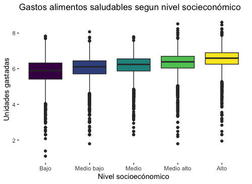

# Postwork sesión 8

## Análisis de la Inseguridad Alimentaria en México

## Desarrollo

### 1. Plantea el problema del caso

De acuerdo a (Shamah-Levy, 2014) la inseguridad alimentaria se define como la disponibilidad limitada o incierta de alimentos nutricionalmente adecuados e inocuos; o la capacidad limitada e incierta de adquirir alimentos adecuados en formas socialmente aceptables. En México, casi una cuarta parte de la población enfrenta algún nivel de inseguridad alimentaria. [^1]

Por ello, un centro de salud nutricional está interesado en analizar estadísticamente y probabilísticamente el fenómeno de la inseguridad alimentaria para poder desarrollar un modelo que permita identificar los determinantes socioeconómicos detrás de ella.

Adicionalmente, se plantea el supuesto de que los hogares con menor nivel socioeconómico tienden a gastar más en productos no saludables que las personas con mayores niveles socioeconómicos y se quiere validar la veracidad de tal dicho.

En el presente trabajo, se analizará la información disponible a fin de concluir, con argumentos estadísticos y probabilísticos, si el supuesto planteado tiene mérito o no y se sugerirá un modelo que explique lo mejor posible el fenómeno de la inseguridad alimentaria en el hogar.

### 2. Realiza un análisis descriptivo de la información

La base de datos proporcionada contiene un total de 40,809 observaciones con 10 variables. En la Tabla 1 se describen las variables.

Tabla 1. Descripción de los datos proporcionados.

 
<!--  -->

    

Después de revisar los datos  originales en R, se realizó la limpieza de los datos y el cambio de algunos tipos de datos para facilitar la manipulación del análisis. En particular, se agegarón dos variables basadas en: __logaritmo natural de gastos en alimentos saludables__ y __logaritmo natural de gastos en alimentos no saludables__ aplicando el antilogaritmo para una mejor interpretación de las cifras. Por último, se eliminaron 20,529 registros que presentaron datos incompletos en alguna variable.

Dado que en los requisitos del problema se solicita analizar los patrones de los __gastos en alimentos saludables (aln)__ y __gastos en alimentos no saludables (alns)__  en los hogares mexicanos en relación a la variables: nivel socioeconómico (nse), si el hogar tienen recursos financieros extras al ingreso (refin) y si presenta o no inseguridad alimentaria (IA). Se presentan las siguientes gráficas para realizar un análisis exploratorio de los datos previo al cálculo de las medidas descriptivas de las variables mencionadas anteriormente.

En la siguiente sección nos enfocamos en primer lugar, en las variables: ln_als, ln_alns.

<!--  -->

    

Gráfica 1. Gasto en alimentos saludables. Las medidas de tendencia central y posición para (ln_als): mínimo: 1.09, primer cuartil: 5.84, media: 6.19 , mediana: 6.27, tercer cuartil: 6.63 y máximo: 8.6

<!--  -->

    

Gráfica 2. Gastos en alimentos saludables. Las medidas de tendencia central y posición para (alns):  mínimo: 0.0, primer cuartil: 3.4, media: 4.11 , mediana: 4.0, tercer cuartil: 4.86 y máximo: 8.29

 

En las Gráficas 1 y 2, se muestran las medidas de tendencia central y de posición. Además, se calculó la desviación estándar para __als__:  0.68  y __alns__:  1.04, con la finalidad de calcular el coeficiente de variación. El __coeficiente de variación__ de als es 11.12% y de alns es de 25.28%. Ambos coeficientes de variación son menores o iguales a 25% por lo que se puede concluir que los datos para ambas variables son homogéneos. Este supuesto se puede inferir gráficamente debido a que las cajas son cortas en ambos gráficos (ver Gráfico 1 y Gráfico 2). Adicional se observar algunos datos atípicos en la parte inferior y superior de las cajas.

 

Para continuar con el análisis de estas dos variables se analizan  visualmente las gráficas de caja de aln de acuerdo al __nivel socioeconómico__ (__nse5f__), ver Gráfica 3,  de acuerdo al recursos financieros distintos al ingreso laboral (ver Gráfica 4) y de la misma forma para inseguridad alimentaria.

 
<!--  -->

    

Gráfica 3. Medidas descriptivas de aln en cada nivel socioeconómico. Media: (bajo = 5.8, medio bajo = 6.03, medio = 6.17, medio alto = 6.32 y alto = 6.53). Desviación estándar (bajo = 0.76, medio bajo = 0.66, medio = 0.60, medio alto = 0.59 y alto =  0.58). Coeficiente de variación (bajo =13.18%, medio bajo = 11.08%, medio = 9.84%, medio alto =  9.43% y alto =  8.93%).

 

En la Gráfica 3 se muestra que el promedio de __gasto de alimentos saludables__ (*__als__*) se incrementa de acuerdo al nivel socioeconómico. Esto proporciona un panorama visual y descriptivo de como los datos pueden ser estudiados en el análisis de la sección 3 y 4.

 
<!--  -->

    

 

Gráfica 4. Medidas de tendencia central y dispersición de als, si la familia indicó recursos financieros distintos al ingreso laboral. Media ( No = 6.17, Si =  6.24), Desviación estándar (No = 0.68, Si = 0.69. Coeficiente de variación (No = 11.20%, Si = 11.08%).

 

En la Gráfica 4, las medias muestran niveles de consumo promedio similares tanto para los que individuos que reportaron ingresos financieros extra distintos al laboral y los que no los tienen. Por lo que es importante considerar este análisis para las próximas secciones.

 

<!--  -->

    

 

Gráfica 5. Medidas de tendencia central  y dispersición de als, de acuerdo a si presentaron o no inseguridad alimentaria en el hogar (IA). Media ( No = 6.29, Si =  6.14), Desviación estándar (No = 0.69, Si = 0.69). Coeficiente de variación (No = 10.96%, Si = 11.22%).

 

De acuerdo con la Gráfica 5, las medias muestran niveles de consumo promedio similares, con un gasto ligeramente mayor de als por las familias que no presentaron IA.

 
<!--  -->

    

 

Gráfica 6. Medidas de tendencia central y dispersión de alns según el nivel socioeconómico de los hogares consultados. Media: (bajo = 3.58, medio bajo = 3.91, medio = 3.91, medio alto = 4.17 y alto = 4.6). Desviación estándar: (bajo = 0.94, medio bajo = 0.94, medio = 0.98, medio alto = 1.02 y alto = 1.05). Coeficiente de variación: (bajo =16.24%, medio bajo = 15.72%, medio = 15.89%, medio alto = 16.14% y alto = 16.19%).

 

En la Gráfica 6, se observa que los promedios de consumo de als se incrementan conforme aumenta el nivel socioeconómico. Además, todos los grupos presentan un coeficiente de variación menos al 25$, lo que nos indica la posibilidad de realizar comparaciones entre los cinco grupos de niveles socioecónomicos en relación al gasto alimentario no saludable.

 

<!--  -->

    

 

Gráfica 7. Medidas de tendencia central y dispersión de alns, con respecto a las familia que indicaron recursos financieros distintos al ingreso laboral. Media ( No = 4.12, Si =  4.10), Desviación estándar (No = 1.04, Si = 1.04. Coeficiente de variación (No =  25.33%, Si = 25.44%).

 

En la gráfica 7 se puede observar que las medias muestran niveles de consumo promedio similares, sin embargo, el promedio de gastos de aquellos que no presentan recursos financieros al ingreso laborales es ligeramente mayor a los que sí lo presentan.

<!--  -->

    

 

Gráfica 8. Medidas de tendencia central de alns, con respecto a las familias que presentan Inseguridad se acercan. Media ( No = 4.33, Si =  4.03), Desviación estándar (No = 1.07, Si = 1.07). Coeficiente de variación (No = 24.81%, Si = 26.64%).

 

En la Gráfica 8, las medias muestran niveles de consumo promedio similares. En el caso de las familias que si presentaron IA el gasto promedio es menor de alns por las familias que no presentaron IA. Esto puede indicar que no hay una relación en el promedio de gasto en alns con respecto a tener IA.

Es importante mencionar que en las Gráficas 3 y 6 se comparan visualmente los gastos promedio en alimentos saludables y no saludables en los distintos niveles socioeconómicos. Se observa que a mayor nivel socioeconómico el promedio de gasto es mayor para ambos casos.

En cuanto al gasto promedio de alimentos saludables y no saludables de acuerdo a si existe recursos financieros distintos al ingreso laboral, son muy similares por lo que en principio no parece se un indicador de comparación. En la gráfica 4 y 6 se observan una tendencia de promedios iguales, para ambos tipos de alimentos (saludables y no saludables).

Con respecto a al gasto promedio de alimentos saludables y no saludables de acuerdo a si presenta o no seguridad alimentaria, el análisis mostró que quienes gastan más en alimentos saludables son lo que pertenecen al grupo de que no presentan seguridad alimentaria (ver Gráfica 5). pero también son los que más gastan en alimentos no saludables (Gráfica 8).

Para continuar el análisis de als y alns se realizaron histogramas que permitan conocer la frecuencia de los gastos que reportaron las familias, tanto de alimentos saludables y no saludables.

 
<!--  -->

    

 

Gráfica 9. Histograma de frecuencia de gasto de alimentos saludables (als). Las medidas de forma indican que tienen un sesgo a la izquierda (skewness = -1.19) y una forma leptocúrtica (curtosis = 6.6).

 

<!--  -->

    

 

Gráfica 10. Histograma de frecuencia de gasto de alimentos no saludables (alns). Las medidas de forma indican que es simétrica (skewness = 0.24 ) y una forma platocúrtica (curtosis = 2.57).

 

Además de las medidas de tendencia central y dispersión se consideró importante calcular las medidas de forma. En el caso de als se tiene un skewness de -1.19 y una curtosis de 6.60, lo que confirma la existencia de un sesgo de los datos a la izquierda; y además, un forma leptocúrtica (ver Gráfica 9).  Para alns se obtuvo un skewnwss de 0.24 y una curtosis de 2.57, es decir, presenta una simetría y una forma mesocúrtica (ver Gráfica 10).

Otra variable que es importante analizar para conocer la frecuencia relativa es la Inseguridad alimentaria en el hogar (IA). En la Gráfica 11 se muestra la frecuencia de si se presenta o no inseguridad alimentaria de acuerdo con los datos proporcionados por la base de datos.

<!--  -->

    

 

Gráfica 11. Se muestra que el 71% de las familias que participaron en la muestra presentan inseguridad alimentaria en el hogar. Por lo tanto, el 28% restante no presentó inseguridad alimentaria.

 

En esta segunda sección, primero se realizó un análisis visual de los datos, para después realizar un análisis descriptivo de los datos. Los resultados obtenidos en los coeficientes de variación indican que el promedio es confiable para realizar comparaciones entre distintos grupos (caso de Gráficas ) .

### 3. Cálculo de probabilidades para entender el problema en México

#### __Cálculo de probabilidad de que una familia presente o no inseguridad alimentaria__

A partir de la Gráfica 11 que presenta la frecuencia relativa de que una familia pertenezca  o no al grupo de inseguridad alimentaria, se presenta un modelo probabilístico basado en el ensayo de Bernoulli y la distribución binomial.

Si se considera que una familia tiene una probabilidad de 0.71 (ver Gráfica 11) de presentar Inseguridad Alimentaria en el hogar en México. Si partimos del supuesto de que en el centro de salud nutricional se realizan 10 estudios a familias para determinar si presentan Inseguridad Alimentaria  (IA), ¿Cuál es la probabilidad de que menos de 4 familias presenten IA?

Para dar respuesta a esta pregunta, primero se realiza un distribución binomial de acuerdo a los datos de IA. Por lo que la Gráfica 12 presenta el resultado de dicha distribución.

<!--  -->

    

 

Gráfica 12. Distribución Binomial resultante. La media =  0.70917 y la desviación estándar =  0.45416. La media teórica esperad es 0.71 y la desviación estándar teórica es =  0.43863.

 

Por lo que con la implementación de una función de distribución acumulada binomial podemos responder a la pregunta, de acuerdo con el cáclulo, se obtiene una probabilidad de 0.00446 que menos de 4 familias de las 10 atendidas en el centro de salud nutricional presenten IA.

Además, podemos calcular otros probabilidades, por ejemplo:

- La probabilidad de que más de 8 de 10 familias presenten Inseguridad Alimentaria en el hogar es de 0.22224.
- La probabilidad de que 7 familias presenten Inseguridad Alimentaria en el hogar es de  0.25628.

#### __Cálculo de probabilidad de los gastos en alimentos no saludables de una familia de acuerdo a su nivel socioeconómico.__

A partir de los gastos de alimentos no saludables (Gráfica 10) se realizan un análisis probabilístico basado en una distribución normal.

Si se considera que los gastos promedio de familia en alimentos no saludables de la Tabla 2, los datos se ajustan a una distribución normal.

Tabla 2. Promedio, mediana, moda y varianza de gasto de alimentos no saludables.

 

    

<!-- |Nivel socioeconómico|Media|Mediana|Moda|Varianza|
|:--------------------|:-----:|:-------:|:----:|:--------:|
|Bajo|3.68|3.58|2.99|0.94|
|Medio bajo|3.9|3.91|3.40|0.94|
|Medio|4.05|3.91|3.40|0.98|
|Medio alto|4.23|4.17|3.91|1.02|
|Alto|4.61|4.6|4.60|1.05| -->

Por lo que si se considerá que en México el salario mínimo para 2023 será de $207.00 pesos, se plantean las siguiente pregunta:

- ¿Cuál es la probabilidad de que el gasto en alimentos no saludables sea menor o igual a medio salario mínimo en cada nivel socioeconómico?

Para dar respuesta a esta pregunta, primero se utiliza la distribución normal para dar respuesta a la probabilidad del intervalo de valor P(X <= 103.5 ), dado que los datos estan en logaritmo natural se realiza la conversión a  P(X <= 4.63).  Las Gráficas 13, 14, 15, 16 y 17, muestran las probabilidades para los niveles socioeconómicos; bajo, medio bajo, medio, medio alto y alto, respectivamente.

<!--  -->

    

 

Gráfica 13. Probabilidad de que una familia de nivel bajo gaste 4.63 unidades equivalentes a $103.5 es  P(X <= 4.63) = 0.84105.

 

<!--  -->

    

 

Gráfica 14. Probabilidad de que una familia de nivel medio bajo gaste 4.63 unidades equivalentes a $103.5 es  P(X <= 4.63) = 0.77619.

 

<!--  -->

    

 

Gráfica 15. Probabilidad de que una familia de nivel medio gaste 4.63 unidades equivalentes a $103.5 es  P(X <= 4.63) = 0.72141.

 

<!--  -->

    

 

Gráfica 16. Probabilidad de que una familia de nivel medio alto gaste 4.63 unidades equivalentes a $103.5 es  P(X <= 4.63) = 0.65151.

 

<!--  -->

    

 

Gráfica 17. Probabilidad de que una familia de nivel medio alto gaste 4.63 unidades equivalentes a $103.50 es  P(X <= 4.63) = 0.50718.

 

Tabla 3. Resumen de las probabilidades obtenidas de gastos de alimentos no saludables por niveles socioeconómicos.

 

    

<!-- |Nivel socioeconómico|Probabilidad|
|:--------------------|:------------:|
|Bajo|0.84105|
|Medio bajo|0.77619|
|Medio|0.72141|
|Medio alto|0.65151|
|Alto|0.50718| -->

 
En la Tabla 3 se muestran que el nivel socioeconómico con mayor probabilidad de gastar $103.50 es el nivel bajo (0.84105), y conforme se aumenta el nivel socioeconómico la probabilidad reduce, hasta llegar a la probabilidad mas baja por el nivel socioeconómico alto (0.50718).
    
### 4. Plantea hipótesis estadísticas y concluye sobre ellas para entender el problema en México

Parte del objetivo del presente trabajo es explorar la veracidad de la siguiente creencia popular:

*__"La mayoría de las personas afirman que los hogares con menor nivel socioeconómico
tienden a gastar más en productos no saludables que las personas con mayores
niveles socioeconómicos y que esto, entre otros determinantes, lleva a que un hogar presente cierta inseguridad alimentaria."__*

Para ello, se pueden utilizar los datos disponibles para realizar pruebas de hipótesis que permitan emitir alguna conclusión. Primero, se transforman las variables __ln_als__ y __ln_alns__ aplicando su función inversa, a modo que se tenga información sobre el gasto real en alimentos saludables y no saludables.

Enseguida se le realizan pruebas de normalidad (tanto Lillie como Shapiro), que arrojan que estas variables no se distribuyen de manera normal pues, al tener un valor p muy pequeño, se rechaza la hipótesis nula de normalidad. Por tal motivo, para todas las siguientes pruebas de hipótesis se utilizará la distribución t de Student.

Se busca saber si, en promedio, quienes pertenecen al nivel socioeconómico más bajo gastan más en alimentos no saludables que los del nivel más alto.

- Ho: *prom_alns_nse5f_bajo >= prom_alns_nse5f_alto*

- Ha: *prom_alns_nse5f_bajo < prom_alns_nse5f_alto*

Como se van a comparar dos medias y los datos no son normales sino distribuidos por una t de Student, siempre es necesario verificar primero si las desviaciones estándar de cada grupo son iguales o diferentes en la población. Aplicando la prueba de cociente de varianzas, se concluye que, como el valor p es menor a 0.01, con una confianza de 99%, las varianzas de ambos niveles socioeconómicos son diferentes.

Con ese supuesto validado, se procede a aplicar una prueba T de diferencia de medias que arroja un valor p muy pequeño, por lo que existe evidencia estadística para rechazar la hipótesis nula de la prueba, concluyendo no sólo que, en promedio, el nivel socioeconómico bajo no gasta lo mismo que el alto en alimentos no saludables sino también que, contrario a la creencia popular, *__las personas de mayor nivel socioeconómico gastan, en promedio, más que las de menor nivel en alimentos no saludables__*.

Como la prueba anterior compara únicamente al nivel socioeconómico más bajo con el más alto, tiene mérito ver si las conclusiones se mantienen agrupando en dos únicos estratos los cinco niveles, considerándose ahora como “Bajo” los niveles “Bajo, “Medio bajo” y “Medio” y como “Alto” a quienes pertenecen a “Medio alto” y “Alto”. Las pruebas arrojan que las varianzas son significativamente diferentes y que hay evidencia estadística para rechazar la hipótesis nula. Por lo tanto, aún agrupando los niveles, en promedio, quienes pertenecen a los 3 niveles socioeconómicos más bajos gastan menos en alimentos no saludables que los de los dos niveles más altos.

Lo anterior se complementa con lo visto en los análisis de probabilidades (ver Tabla 3) y coincide con lo observado en la realidad, pues las personas de nivel socioeconómico más bajo son más propensos a adquirir alimentos no saludables tan sólo por tener más fácil y rápido acceso (geográfico y económico) a ellos que a los saludables, como ejemplo los puestos de garnachas, frituras, etc. No obstante, en la práctica y a pesar de ser menos propensos a ello, quienes efectivamente gastan más en alimentos no saludables son los que pertenecen a mayores niveles socioeconómicos, lo cual tiene sentido, pues cuentan con más dinero disponible para gastar y tienen acceso a comida más refinada y procesada que no necesariamente es saludable.

A continuación se analiza si existe evidencia estadística para determinar si, en promedio, el nivel socioeconómico tiene efectos sobre el gasto en alimentos no saludables.

- Ho: *prom_alns_bajo = prom_alns_medio_bajo = prom_alns_medio = prom_alns_medio_alto = prom_alns_alto*
- Ha: *Al menos uno es diferente*

El análisis de varianza (ANOVA)  arroja un p-value muy pequeño, por lo que, a nivel de confianza de 99%, existe evidencia estadística para rechazar la hipótesis nula y, así, al menos una de las medias entre grupos es diferente y el nivel socioeconómico sí es un factor que influye en el gasto en alimentos no saludables.

Ahora bien, tiene mérito analizar si la zona geográfica (area) y los ingresos extra (refin) también tienen influencia en el consumo de alimentos no saludables, por lo que se repitieron las pruebas anteriores, ahora diferenciando por éstas variables.

En relación a la zona geográfica, se concluye que las varianzas de gastos entre la zona rural y urbana son diferentes; asimismo, al no existir evidencia estadística significativa, no se puede rechazar la hipótesis de que en la zona urbana gastan más o igual que en la rural en alimentos no saludables; por último, con el ANOVA se tiene que la zona geográfica sí es un factor determinante en el gasto promedio en alimentos no saludables. De hecho, al rechazarse la hipótesis de igualdad de medias, se puede asegurar que, en promedio, en las zonas urbanas se gasta más en alimentos no saludables que en las rurales. Esto hace sentido con hallazgos anteriores porque es en estas zonas donde normalmente viven las personas con mayor nivel socioeconómico.

Hablando de la variable indicadora de ingresos extra, se obtuvo que las varianzas efectivamente son diferentes y que no hay evidencia estadística para rechazar que las personas con ingreso extra gastan más o igual que las que no lo tienen en alimentos no saludables. El ANOVA arroja un valor p mayor a 0.01, por lo que no se rechaza la hipótesis de que las medias son iguales. Así, el ingreso extra no sería una variable significativa ni determinante en el gasto en alimentos no saludables.

Cabe señalar que todos los análisis anteriores sobre el nivel socioeconómico, la zona geográfica y los ingresos extra se repitieron pero ahora para el gasto en alimentos saludables. Los resultados fueron muy similares:

- El nivel socioeconómico sí es una variable influyente en este gasto (al menos en uno de los grupos la media es distinta) y, en promedio, los niveles altos gastan más en alimentos saludables que los bajos, lo cual tiene sentido porque tienen los medios económicos y sociales para acceder a ellos, basta recordar el dicho de que “Comer sano cuesta caro”.

- Existen diferencias en el gasto promedio en alimentos saludables según la zona geográfica, siendo la zona urbana donde se presenta un gasto mayor, lo cual es lógico pues allí viven personas con más nivel socioeconómico.

- No existe evidencia estadística para rechazar que las personas con ingresos extra gastan, en promedio, más o igual en alimentos saludables que las que no los tienen. Sin embargo, sí hay evidencia para rechazar la hipótesis de igualdad de medias, por lo que se puede concluir que las personas con ingresos extra gastan más en alimentos saludables que las que no tienen, contrario a lo que pasa en alimentos no saludables. Lo anterior sugiere que las personas que tienen ingresos extra prefieren gastarlo en alimentos saludables antes que en no saludables.

Por último, con todo lo realizado hasta ahora, se comprueba que el gasto en alimentos no saludables sí influye en la seguridad alimentaria en el hogar.

### 5. Estima un modelo de regresión, lineal o logístico, para identificar los determinantes de la inseguridad alimentaria en México

Como se busca entender qué factores influyen en la inseguridad alimentaria se define IA como la variable objetivo o dependiente. Debido a que ésta es de tipo dicotómico, se sugiere utilizar una regresión logística como modelo, pues la regresión lineal es apropiada para variables numéricas continuas. Para una mejor interpretación, en la modelación se transformarán los logaritmos de gasto en alimentos saludables y no saludables, aplicando la exponencial, su función inversa, para que queden los gastos en unidades regulares.

Como primera aproximación, se compararon dos modelos: uno que explica la inseguridad alimentaria en términos de todas las variables disponibles como predictores y otro que, además, utilice todos los posibles términos de interacción con las variables categóricas  refin, nse5f, sexojef y area.

__Modelo 1__: *IA ~ nse5f + area + numpeho + refin + edadjef + sexojef + añosedu + als + alns*

__Modelo 2__: *IA ~ nse5f + area + numpeho + refin + edadjef + sexojef + añosedu + als + alns + numpeho:refin + añosedu:refin + edadjef:refin + als:refin + alns:refin + nse5f:refin + area:refin + sexojef:refin + numpeho:area + añosedu:area + edadjef:area + als:area + alns:area + nse5f:area + sexojef:area + numpeho:sexojef + añosedu:sexojef + edadjef:sexojef + als:sexojef + alns:sexojef + nse5f:sexojef + numpeho:nse5f + añosedu:nse5f + edadjef:nse5f + als:nse5f + alns:nse5f*

Tabla 4. Comparativa de métricas de desempeño de los modelos con y sin interacciones de variables dicotómicas.

 

    

<!-- |Modelo|AIC|Pseudo R2|
|:------|:---:|:---------:|
|Modelo 1|22168|0.09125799|
|Modelo 2|22116|0.09555227| -->

Como el AIC es menor y la bondad de ajuste es más grande, se tiene que el modelo 2 es mejor que el 1; considerando además que hay términos de interacciones cuyos coeficientes son significativamente distintos de cero, se puede concluir que las interacciones sí aportan a la explicación de la variable objetivo.

No obstante, existen términos con un valor p mayor a 0.05, lo que indica que no hay evidencia estadística para rechazar que el valor de sus coeficientes es igual a cero, es decir, no son significativos, por lo que deben ser eliminados del modelo. Así pues, se sugiere un tercer modelo con las siguientes variables explicativas:

__Modelo 3__: *IA ~ numpeho + refin + edadjef + sexojef + añosedu + als + alns + numpeho:area + añosedu:sexojef + edadjef:sexojef + añosedu:nse5f + edadjef:nse5f*

Éste arroja un AIC de 22087 y una bondad de ajuste de 0.09483598, que si bien es menor que la del modelo 2, no se considera una diferencia tan significativa como sí lo es la del AIC a favor de este modelo, por lo que hasta ahora se proclama como el mejor. Cabe señalar que se probó este mismo modelo pero con la transformación logarítmica para als y alns, pero al arrojar un AIC de 22092 y una bondad de ajuste de 0.09463171, resulta peor.

Ahora bien, pese a que el modelo 3 resultó ser el de mejores métricas, tiene un problema grave de multicolinealidad que se descubrió aplicando la prueba de inflación de varianza (VIF). Como es importante tener un modelo que cumpla con los supuestos de la regresión logística, se eliminó el término sexojef, que tenía VIF de 27.01, el mayor de todos. Hay que recordar que VIF’s mayores a 10 son indicadores de multicolinealidad.  Así, se tiene.

__Modelo 4__:  *IA ~ numpeho + refin + edadjef + añosedu + als + alns + numpeho:area + añosedu:sexojef + edadjef:sexojef + añosedu:nse5f + edadjef:nse5f*

A continuación se validaron los supuestos para el modelo 4:

a) Multicolinealidad: No se obtuvo ningún VIF mayor que 10 para ninguno de los predictores, de modo que no hay evidencias de multicolinealidad y el supuesto se cumple.

b) Independencia:

<!--  -->

    

Gráfica 18. Residuales del modelo ajustado.

 

En el gráfico de residuales se observan más residuos negativos que positivos, sin embargo, no se ve ningún patrón definido que pudiera indicar un grado de dependencia entre las observaciones, por lo que el supuesto se cumple.

c) Linealidad: Para contrastar este supuesto se necesita ejecutar la regresión logística pero incluyendo como predictores adicionales el producto entre cada predictor y el logaritmo de sí mismo. Luego de crear dichos términos y correr el modelo correspondiente, se tiene que no existe evidencia estadística para rechazar la hipótesis de que los productos son igual a cero, de modo que el supuesto de linealidad se cumple.

Así pues, __¡el modelo 4 cumple con todos los supuestos de la regresión logística!__

Tabla 4. Comparativa de resultados de los modelos 3 y 4.

 
    

    

<!-- |Modelo|AIC|Pseudo R2|
|:------|:---:|:---------:|
|Modelo 3| 22087|0.09483598|
|Modelo 4|22089|0.09467564| -->

Nótese que incluso cuando ambas métricas del modelo 4 son ligeramente peores, es más importante que el modelo cumpla los supuestos debidos porque, de lo contrario, no podría concluirse nada con él. Entonces, se concluye que el modelo que cumple los supuestos de regresión logística y explica mejor el fenómeno de la inseguridad alimentaria en el hogar es el modelo 4 y que los factores que influyen en él son: el número de personas en el hogar, si se tiene o no recursos financieros distintos al ingreso laboral, los años de educación del jefe de familia, el gasto en alimentos saludables y el gasto en alimentos no saludables; también importan algunas interacciones como la edad y el sexo del jefe de familia y los años de educación con el nivel socioeconómico.

Una vez que se conocen las variables explicativas, tiene mérito establecer si influyen de manera positiva o negativa sobre la variable objetivo. Para ello, se analizan los coeficientes, pero deben ser elevados a la exponencial pues la regresión logística arroja coeficientes que tienen aplicados logaritmos.

Tabla 5. Variables involucradas y coeficientes del modelo campeón.

 

    

<!-- |Variable|Coeficiente|Variable|Coeficiente|
|:--------|:-----------:|:--------|:-----------:|
|Intercepto|2.4644254|alns|0.9994064|
|numpeho|1.2080799|numpeho:area|0.9662002|
|refin|1.4956810|añosedu:sexojef|1.0320940|
|edadjef|1.0226579|edadjef:sexojef|0.9957723|
|añosedu|0.9695440|añosedu:nse5f|0.9917262|
|als|0.9997761|edadjef:nse5f|0.9938537| -->

Si el valor es mayor que 1, entonces indica que a medida que aumenta el predictor, las probabilidades de los resultados aumentan. A la inversa, un valor menor que 1 indica que a medida que aumenta el predictor, las probabilidades de los resultados disminuyen. Para efectos de esta investigación, se puede decir, por ejemplo, que las probabilidades de que un hogar sufra inseguridad alimentaria aumentarán 1.49 veces si está en una zona rural y no en una urbana. También se identifica que las variables con relación directa con la inseguridad alimentaria son numpeho, refin, edadjef y la interacción añosedu:sexojef, mientras que el resto tiene una relación inversa.

Tabla 6. Intervalos de confianza para los coeficientes de los predictores.

 
    

    

<!-- |Variable|2.5%|97.5%|Variable|2.5%|97.5%|
|:--------|:----:|:-----:|:--------|:----:|:-----:|
|Intercepto|1.9933520|3.0480279|alns|0.9991845|0.9996264|
|numpeho|1.1820358|1.2349334|numpeho:area|0.9481619|0.9846686|
|refin|1.3706795|1.6334161|añosedu:sexojef|1.0199859|1.0443211|
|edadjef|1.0184790|1.0268991|edadjef:sexojef|0.9929893|0.9985863|
|añosedu|0.9526730|0.9865828|añosedu:nse5f|0.9879187|0.9955657|
|als|0.9996744|0.9998777|edadjef:nse5f|0.9929008|0.9947976| -->

Como ninguno de los intervalos de confianza cruza el 1, se puede afirmar con un 97.5% de confianza que la dirección de las relaciones observadas para cada variable es cierta en la población.

De este modo, se recomendó un modelo que explica el fenómeno de la inseguridad alimentaria en los hogares, identificando los factores que influyen más y en qué proporción, así como su relación con la variable estudiada.

## Recursos

[^1]:Inseguridad Alimentaria casi un cuarto de la población mexicana (<https://unamglobal.unam.mx/inseguridad-alimentaria-casi-un-cuarto-de-la-poblacion-mexicana>) Fecha de consulta: 12/12/2022.

