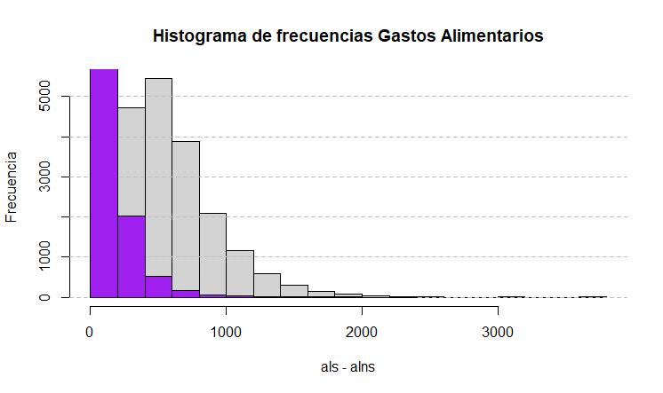

# Postwork sesión 8

## Análisis de la Inseguridad Alimentaria en México

### DESARROLLO

#### 1. Plantea el problema del caso

De acuerdo a (Shamah-Levy, 2014) la inseguridad alimentaria se define como la disponibilidad limitada o incierta de alimentos nutricionalmente adecuados e inocuos; o la capacidad limitada e incierta de adquirir alimentos adecuados en formas socialmente aceptables. En México, casi una cuarta parte de la población enfrenta algún nivel de inseguridad alimentaria (1).

Por ello, un centro de salud nutricional está interesado en analizar estadísticamente y probabilísticamente el fenómeno de la inseguridad alimentaria para poder desarrollar un modelo que permita identificar los determinantes socioeconómicos detrás de ella.

Adicionalmente, se plantea el supuesto de que los hogares con menor nivel socioeconómico tienden a gastar más en productos no saludables que las personas con mayores niveles socioeconómicos y se quiere validar la veracidad de tal dicho.

En el presente trabajo, se analizará la información disponible a fin de concluir, con argumentos estadísticos y probabilísticos, si el supuesto planteado tiene mérito o no y se sugerirá un modelo que explique lo mejor posible el fenómeno de la inseguridad alimentaria en el hogar.

#### 2. Realiza un análisis descriptivo de la información

La base de datos proporcionada contiene un total de 40,809 observaciones con 10 variables. En la Tabla 1 se describen las variables.

<!--  -->

Después de revisar los datos  originales en R, se realizó la limpieza de los datos y el cambio de algunos tipos de datos para facilitar la manipulación del análisis. En particular, se realizó el cambio de las variables: logaritmo natural de gastos en alimentos saludables y logaritmo natural de gastos en alimentos no saludables aplicando el antilogaritmo para una mejor interpretación de las cifras. Por último, se eliminaron 20,529 registros que presentaron datos incompletos en alguna variable.  
Dado que en los requisitos del problema se solicita analizar los patrones de los gastos en alimentos saludables (aln) y gastos en alimentos no saludables (alns)  en los hogares mexicanos en relación a la variables: nivel socioeconómico (nse), si el hogar tienen recursos financieros extras al ingreso (refin) y si presenta o no inseguridad alimentaria (IA). Se presentan las siguientes gráficas para realizar un análisis exploratorio de los datos previo al cálculo de las medidas descriptivas de las variables mencionadas anteriormente.

En la siguiente sección nos enfocamos en primer lugar, en las variables: als, alns.
<!--  -->

Gráfica 1. Los gasto en alimentos saludables (ln_als)  muestran un mínimo: 1.09, primer cuartil: 5.84, media: 6.19 , mediana: 6.27, tercer cuartil: 6.63 y máximo: 8.6

<!--  -->

Gráfica 2. Los gastos en alimentos saludables (alns) muestran un mínimo: 0.0, primer cuartil: 3.4, media: 4.11 , mediana: 4.0, tercer cuartil: 4.86 y máximo: 8.29

En las Gráficas 1 y 2, se muestran las medidas de tendencia central y de posición. Además, se calculó la desviación estándar para als:  0.68  y alns:  1.04, con la finalidad de calcular el coeficiente de variación. El coeficiente de variación de als es 11.12% y de alns es de 25.28%. Ambos coeficientes de variación son menores o iguales a 25% por lo que se puede concluir que los datos para ambas variables son homogéneos. Este supuesto se puede inferir gráficamente debido a que las cajas son cortas en ambos gráficos (ver Gráfico 1 y Gráfico 2). Adicional se observar algunos datos atípicos en la parte inferior y superior de las cajas.

Para continuar con el análisis de estas dos variables se analizan  visualmente las gráficas de caja de aln de acuerdo al nivel socioeconómico (nse), ver Gráfica 3,  de acuerdo al recursos financieros distintos al ingreso laboral (ver Gráfica 4) y de la misma forma para inseguridad alimentaria .

Gráfica 3. En esta gráfica se muestran las medidas descriptivas de aln en cada nivel socioeconómico. Las medias son: (bajo = 5.8, medio bajo = 6.03, medio = 6.17, medio alto = 6.32 y alto = 6.53). Desviación estándar (bajo = 0.76, medio bajo = 0.66, medio = 0.60, medio alto = 0.59 y alto =  0.58). Coeficiente de variación (bajo =13.18%, medio bajo = 11.08%, medio = 9.84%, medio alto =  9.43% y alto =  8.93%).

Los promedio en la Gráfica 3 muestran que el promedio de gasto de alimentos saludables (als) se incrementa de acuerdo al nivel socioeconómico.

Gráfico 4. Muestra las medidas de tendencia central de als, si la familia indicó recursos financieros distintos al ingreso laboral. Media ( No = 6.17, Si =  6.24), Desviación estándar (No = 0.68, Si = 0.69. Coeficiente de variación (No = 11.20%, Si = 11.08%).

Las medias muestran niveles de consumo promedio similares tanto para los que individuos que reportaron ingresos financieros extra distintos al laboral y los que no los tienen. Por lo que se puede anticipar que esta variable no proporciona suficiente información para determinar el consumo de als.

Gráfica 5. Muestra las medidas de tendencia central de als, de acuerdo a si presentaron o no inseguridad alimentaria en el hogar (IA). Media ( No = 6.29, Si =  6.14), Desviación estándar (No = 0.69, Si = 0.69). Coeficiente de variación (No = 10.96%, Si = 11.22%).

Las medias muestran niveles de consumo promedio similares, con una ligero gasto mayor de als por las familias que no presentaron IA.

Gráfica 6. El gráfico muestra  las medidas de tendencia central de alns según el nivel socioeconómico de los hogares consultados. Las medias son: (bajo = 3.58, medio bajo = 3.91, medio = 3.91, medio alto = 4.17 y alto = 4.6). , Desviación estándar (bajo = 0.94, medio bajo = 0.94, medio = 0.98, medio alto = 1.02 y alto = 1.05). Coeficiente de variación (bajo =16.24%, medio bajo = 15.72%, medio = 15.89%, medio alto = 16.14% y alto = 16.19%).

Se observa que los promedios de consumo de als se incrementan conforme aumenta el nivel socioeconómico, sin embargo, ???.

Gráfica 7. Muestra las medidas de tendencia central de alns, con respecto a las familia que indicaron recursos financieros distintos al ingreso laboral. Media ( No = 4.12, Si =  4.10), Desviación estándar (No = 1.04, Si = 1.04. Coeficiente de variación (No =  25.33%, Si = 25.44%).

En la gráfica 7 se puede observar que las medias muestran niveles de consumo promedio similares, sin embargo, el promedio de gastos de aquellos que no presentan recursos financieros al ingreso laborales es ligeramente mayor a los que sí lo presentan.

![gráfica de boxplot de alns vs  IA)(./assets/boxplot_alns_vs_IA.png)

Gráfica 8. Se observa que las medidas de tendencia central de alns, con respecto a las familias que presentan Inseguridad se acercan. Media ( No = 4.33, Si =  4.03), Desviación estándar (No = 1.07, Si = 1.07). Coeficiente de variación (No = 24.81%, Si = 26.64%).

Las medias muestran niveles de consumo promedio similares, con una  gasto promedio mayor de alns por las familias que no presentaron IA.

En las Graficas 3 y 6 permiten comparar los gastos promedio en alimentos saludables y no saludables en los distintos niveles socioeconómicos. Se observa que a mayor nivel socioeconómico el promedio de gasto es mayor.
En cuanto al gasto promedio de alimentos saludables y no saludables de acuerdo a si existe recursos financieros distintos al ingreso labora, son muy similares por lo que no parece se un indicador de comparación. En la gráfica 4 y 6 se observan una tendencia de promedios iguales, para ambos tipos de alimentos (saludables y no saludables).
Con respecto a al gasto promedio de alimentos saludables y no saludables de acuerdo a si presenta o no seguridad alimentaria, el análisis mostro que quienes gastan más en alimentos saludables son lo que pertenecen al grupo de que no presentan seguridad alimentaria (ver Gráfica 5). pero también son los que más gastan en alimentos no saludables (Gráfica 8).

Para continuar el análisis de als y alns se realizaron histogramas que permitan conocer la frecuencia de los gastos que reportaron las familias, tanto de alimentos saludables y no saludables.

als

alns

als - alns

Además de las medidas de tendencia central y dispersión se consideró importante calcular las medidas de forma. En el caso de als se tiene un skewness de 1.69 y una kurtosis de, lo que confirma la existencia de un sesgo de los datos a la izquierda; y además, un forma leptocúrtica.  Para alns se obtuvo un skewnwss de 4.91 y una kurtosis de 57.41, es decir, presenta un sesgo a la derecha y una forma leptocúrtica.

Otra variable que es importante analizar para conocer la frecuencia relativa es la Inseguridad alimentaria en el hogar (IA). En la Gráfica X. se muestra la frecuencia de si se presenta o no inseguridad alimentaria en los datos proporcionados de la base de datos

ia

--Aquí se ocupa gráfica de frecuencia de IA---
En la Gráfica X, se muestra que el 74% de las familias que participaron en la muestra presentan inseguridad alimentaria en el hogar. Por lo tanto, el 26% restante no presentó riesgo.

En esta segunda sección, primero se realizó un análisis visual de los datos, para después realizar un análisis descriptivo de los datos. Los resultados obtenidos en los coeficientes de variación indican que el promedio no es confiable para dar respuesta a las cuestiones planteadas en la sección uno, incluso la mediana y las medidas de posición no son concluyentes debido a la cantidad de datos atípicos que muestra la base de datos utilizada. Por lo tanto realizaremos en la siguiente sección un análisis probabilístico que nos permite explicar el problema.

#### 3. Cálculo de probabilidades para entender el problema en México
